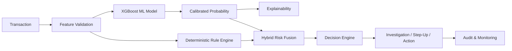

<div align="center">


<br />

# RazorBrain

<h3><strong>End-to-End MLOps & Fraud Risk Assessment Platform for Razorpay</strong></h3>

<sub>Track 02 — AI Risk Manager &nbsp;·&nbsp; AI Buildathon 2026</sub>

<br />


<br />

<table>
  <tr>
    <td align="center" width="340">
      <strong>Live Dashboard</strong><br />
      <sub>React UI — Real-time fraud monitoring, transaction review & investigations</sub><br /><br />
      <a href="https://razorbrain-frontend.onrender.com">
        
      </a>
    </td>
    <td align="center" width="340">
      <strong>Live API</strong><br />
      <sub>FastAPI inference server — Scoring, risk rules, and hybrid decisioning</sub><br /><br />
      <a href="https://razorbrain.onrender.com/">
        
      </a>
    </td>
  </tr>
</table>

</div>

---

## Overview

RazorBrain is a production-oriented fraud risk assessment platform combining machine learning, deterministic risk rules, hybrid decisioning, investigation workflows, and explainability.

---

## Architecture



---

## Project Structure

```text
RazorBrain/
├── api/                  # FastAPI backend application
├── model/                # ML pipeline, inference, and explainability
├── database/             # SQLite database migrations and access
├── frontend/             # React/Vite frontend UI
├── tests/                # Automated test suite
├── data/                 # Model artifacts (.joblib)
├── docker-compose.yml    # Local multi-container orchestration
└── README.md             # Project documentation
```

---

## Quick Start

```bash
# Clone repository
git clone https://github.com/SudarshanSingh1/RazorBrain.git
cd RazorBrain

# Start with Docker
docker compose up --build
```

| Access Point | URL |
|---|---|
| Dashboard | http://localhost:5173 |
| API | http://localhost:8000 |
| Docs | http://localhost:8000/docs |

---

## Environment Variables

| Variable | Description |
|---|---|
| `RAZORBRAIN_API_KEY` | Backend API key for secure access |
| `RAZORBRAIN_CORS_ORIGINS` | Allowed CORS origins (e.g. `*`) |
| `VITE_API_URL` | Frontend connection to backend API |
| `VITE_API_KEY` | Frontend key matching backend API key |

---

## Author

**Sudarshan Kushwaha**

AI Buildathon 2026 — Track 02: AI Risk Manager
