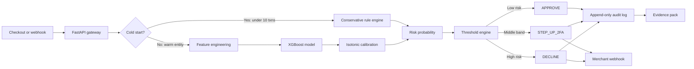
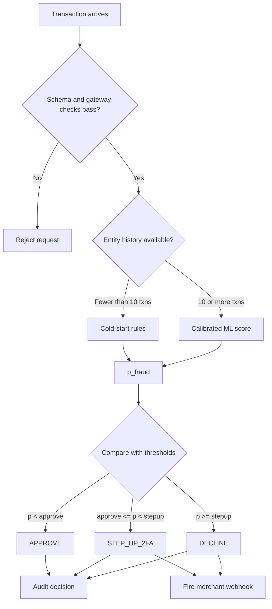
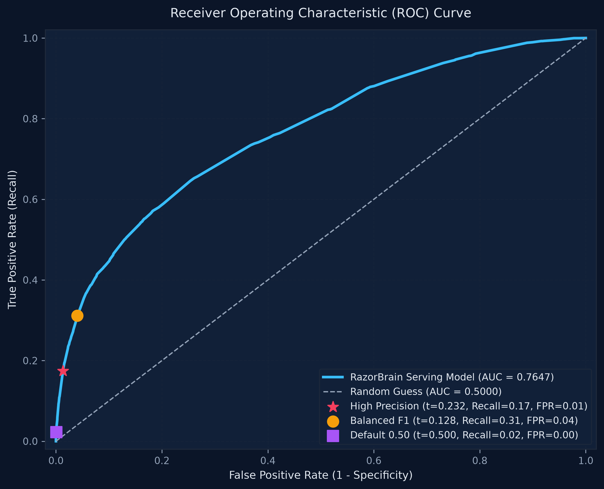
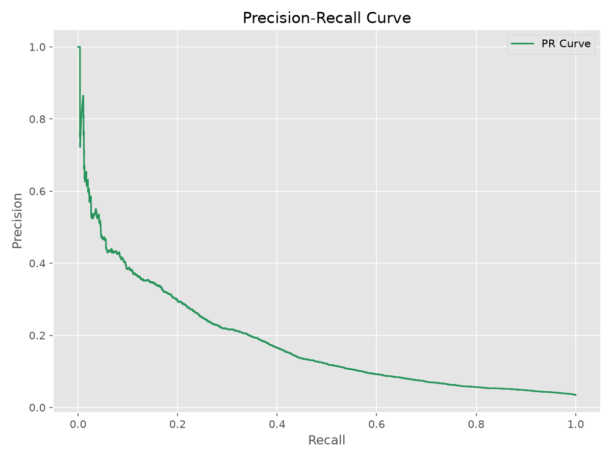
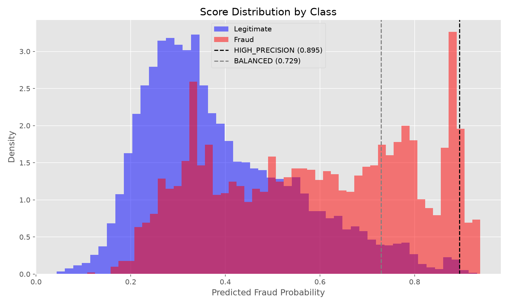
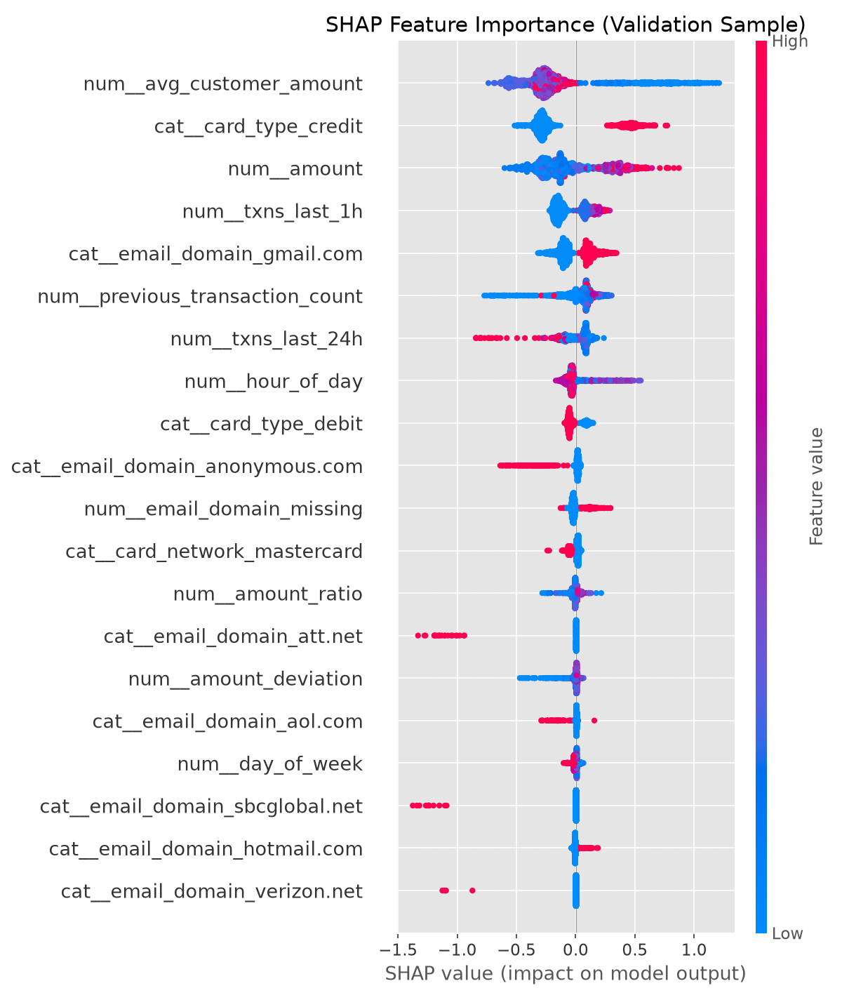
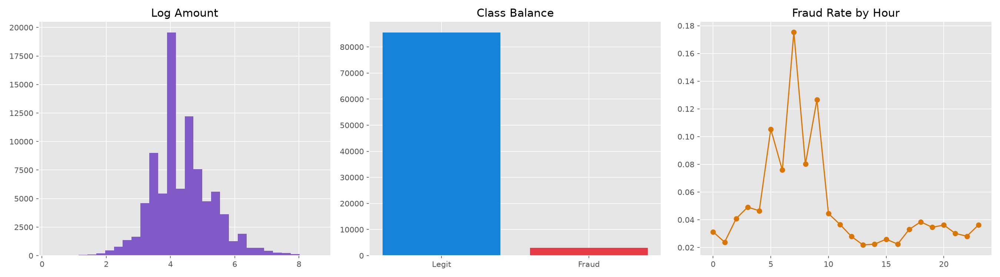

<div align="center">


<br />

# RazorBrain

<h3><strong>End-to-End MLOps Pipeline for Low-Latency Transaction Scoring and Continuous Model Monitoring</strong></h3>

<sub>Track 02 — AI Risk Manager &nbsp;·&nbsp; AI Buildathon 2026</sub>

<br />


<br />

<table>
  <tr>
    <td align="center" width="340">
      <strong>Live Dashboard</strong><br />
      <sub>React UI — real-time fraud monitoring, scoring, and drift detection</sub><br /><br />
      <a href="https://razorbrains.onrender.com">
        
      </a>
    </td>
    <td align="center" width="340">
      <strong>Live API</strong><br />
      <sub>FastAPI inference server — /score, /batch, /audit, /health endpoints</sub><br /><br />
      <a href="https://razorbrain.onrender.com/">
        
      </a>
    </td>
  </tr>
</table>

</div>

---

## Table of Contents

- [Overview](#overview)
- [Architecture](#architecture)
- [Evaluation Metrics](#evaluation-metrics)
- [Project Structure](#project-structure)
- [Quick Start](#quick-start)
- [Features](#features)
- [Model Training](#model-training)
- [Tech Stack](#tech-stack)
- [Environment Variables](#environment-variables)
- [Author](#author)

---

## Overview

RazorBrain is a production-grade fraud detection system that scores transactions in real time, generates explainable decisions with SHAP reason codes, and integrates directly with Razorpay's test-mode API. Every decision is logged to an immutable audit trail and can be exported as a chargeback evidence pack.

The system handles the full fraud detection lifecycle — from transaction ingestion and feature engineering, through ML inference and threshold routing, to merchant webhook delivery and drift monitoring.

| Signal | Value |
|---|---|
| **Fraud model** | XGBoost + isotonic calibration |
| **Decision paths** | ML inference or conservative cold-start rules |
| **Outputs** | Approve, step up with 2FA, or decline |
| **Controls** | Explainable reasons, immutable audit, drift monitoring |
| **Interfaces** | FastAPI, React, Razorpay test mode |

> **Important:** This project is configured for Razorpay **test mode**. Use test credentials in `.env` and never commit secrets.

---

## Architecture

The scoring path keeps low-history entities conservative while giving established entities the full calibrated model path.

### Scoring Pipeline



### Decision Routing



---

## Evaluation Metrics

Evaluated on the IEEE-CIS Fraud Detection dataset — Validation transactions

<br />

<div align="center">



<br /><sub>Precision–recall, ROC, and threshold distribution across HIGH_PRECISION and BALANCED modes</sub>
</div>

---

## Project Structure

```text
RazorBrain/
├── api/                  # FastAPI backend application
├── model/                # ML pipeline, inference, and explainability
├── database/             # SQLite database migrations and access
├── frontend/             # React/Vite frontend UI
├── tests/                # Automated test suite
├── data/                 # Model artifacts (.joblib)
├── outputs/              # Generated ML reports and visuals
├── scripts/              # Automation and reporting scripts
├── compose.yaml          # Local multi-container orchestration
└── README.md             # Project documentation
```

---

## Quick Start

**Prerequisites:** Python 3.12, Node.js, Docker, Razorpay test account

```bash
# Clone repository
git clone https://github.com/SudarshanSingh1/RazorBrain.git
cd RazorBrain

# Start with Docker
docker compose up --build
```

| Access Point | URL |
|---|---|
| Dashboard | http://localhost:5173 |
| API | http://localhost:8000 |
| Docs | http://localhost:8000/docs |

---

## Features

### Core Capabilities

| Feature | Description |
|---|---|
| Real-time inference | Sub-50ms fraud scoring via XGBoost with calibration |
| Cold-start handling | Rule-based fallback for entities with fewer than 10 transaction history |
| Explainability | TreeSHAP reason codes for every decision |
| Razorpay integration | Direct test-mode order creation and webhook delivery |
| Immutable audit trail | Append-only SQLite log of all decisions |
| Drift monitoring | PSI and KL divergence detection between reference and current windows |

<br />

<div align="center">

<br /><sub>Top features by mean absolute SHAP value — computed on the validation set</sub>
</div>

---

## Model Training

<div align="center">

<br /><sub>Exploratory data analysis — transaction amount distribution, class imbalance, and fraud rate by hour</sub>
</div>

---

## Tech Stack

| Component | Technology |
|---|---|
| API Server | FastAPI, Uvicorn, Pydantic |
| ML Model | XGBoost, scikit-learn |
| Explainability | SHAP (TreeSHAP) |
| Dashboard | React, TypeScript, Vite |
| Database | SQLite |
| Containerization | Docker, docker-compose |

---

## Environment Variables

| Variable | Description |
|---|---|
| `RAZORBRAIN_API_KEY` | Backend API key for secure access |
| `RAZORBRAIN_CORS_ORIGINS` | Allowed CORS origins (e.g. `*`) |
| `VITE_API_URL` | Frontend connection to backend API |
| `VITE_API_KEY` | Frontend key matching backend API key |

---

## Author

**Sudarshan Kushwaha**

AI Buildathon 2026 — Track 02: AI Risk Manager

GitHub: [SudarshanSingh1](https://github.com/SudarshanSingh1)

---

<div align="center">

Built for Razorpay AI Buildathon 2026

</div>
