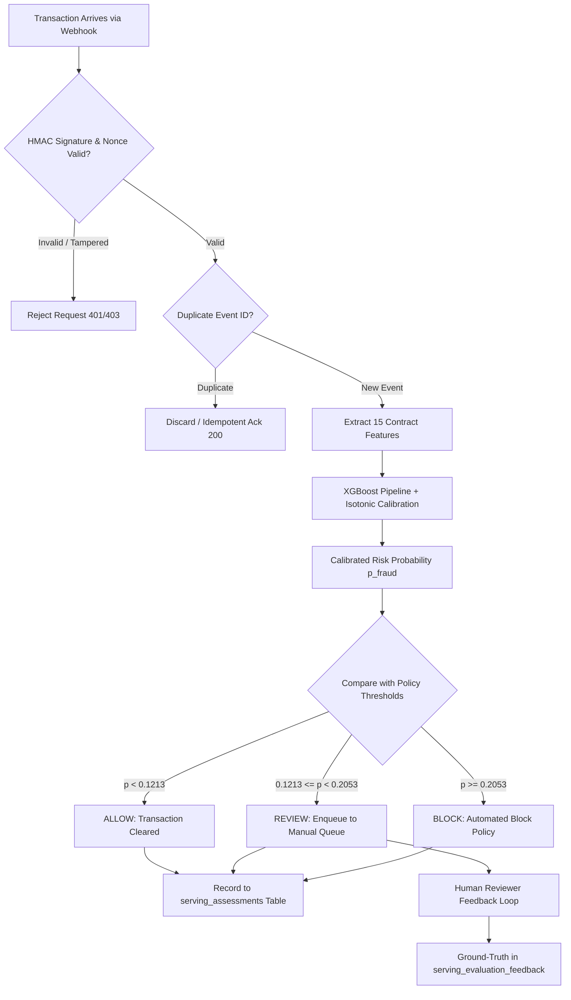
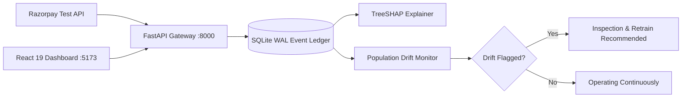
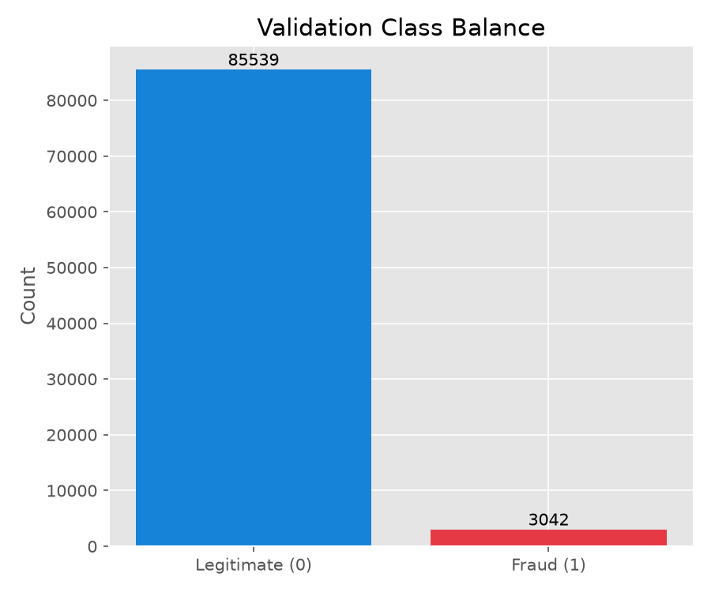
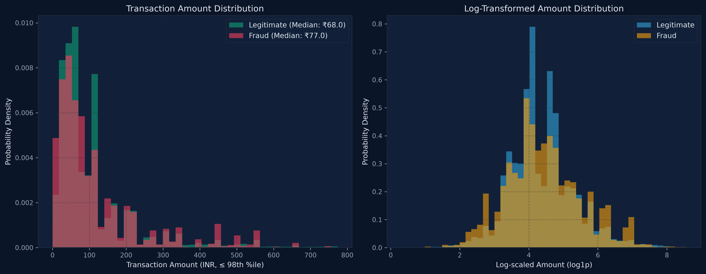
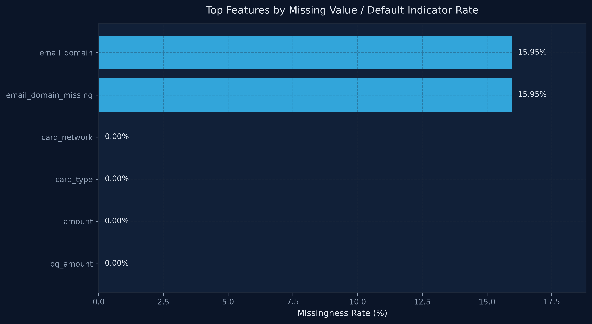

<div align="center">


<br /><br />

# RazorBrain

<h3><strong>End-to-End MLOps Pipeline for Low-Latency Transaction Scoring and Continuous Model Monitoring</strong></h3>

<sub>Track 02 — AI Risk Manager &nbsp;·&nbsp; AI Buildathon 2026</sub>

<br />


<br />

<table>
  <tr>
    <td align="center" width="340">
      <strong>Live Operations Dashboard</strong><br />
      <sub>React 19 ops panel — real-time fraud monitoring, review queue, SHAP explanations, and drift detection</sub><br /><br />
      <a href="http://localhost:5173">
        
      </a>
    </td>
    <td align="center" width="340">
      <strong>Live API Server</strong><br />
      <sub>FastAPI inference engine — /razorpay/test/assess, /transactions/assess, /health, /ready</sub><br /><br />
      <a href="http://localhost:8000/docs">
        
      </a>
    </td>
  </tr>
</table>

</div>

---

## Table of Contents

- [Overview](#overview)
- [Architecture](#architecture)
- [Evaluation Metrics](#evaluation-metrics)
- [Project Structure](#project-structure)
- [Quick Start](#quick-start)
- [API Reference](#api-reference)
- [Dashboard](#dashboard)
- [Features](#features)
- [Test Suite](#test-suite)
- [Cold-Start Handling](#cold-start-handling)
- [Drift Detection](#drift-detection)
- [Model Training](#model-training)
- [Tech Stack](#tech-stack)
- [Docker Deployment](#docker-deployment)
- [Environment Variables](#environment-variables)
- [Implementation Status](#implementation-status)
- [Author](#author)

---

## Overview

**RazorBrain** is an enterprise-grade AI risk manager designed to score transaction risk in real time, generate mathematically rigorous SHAP reason codes, and integrate defensively with Razorpay's test-mode payment gateway and webhooks. Every operational assessment is recorded in an immutable, append-only SQLite WAL ledger and can be inspected via an interactive React 19 operations cockpit.

The system manages the entire transaction fraud lifecycle — from idempotent webhook ingestion and strict 15-feature contract extraction, through XGBoost inference and isotonic probability calibration, to automated policy routing (`ALLOW`, `REVIEW`, `BLOCK`) and continuous population drift monitoring.

| Signal | Value |
|---|---|
| **Fraud Model** | XGBoost (`XGBClassifier`) + Isotonic Regression calibration |
| **Decision Paths** | 15-feature contract ML inference with cold-start conservative fallback |
| **Outputs** | `ALLOW` (cleared), `REVIEW` (prioritized queue), or `BLOCK` (policy denial) |
| **Controls** | TreeSHAP feature explanations, immutable WAL audit ledger, population drift monitoring |
| **Interfaces** | FastAPI REST API, React 19 + Vite dashboard, Razorpay Test Mode |

> **Important:** This project is configured for **Razorpay Test Mode**. The underlying serving model was trained on restricted IEEE-CIS public fraud data (US e-commerce) with strict causal guarantees and no identity leakage. Financial metrics and SHAP patterns exhibited demonstrate architectural capability and production readiness. Use test credentials in `.env` and never commit secrets.

---

## Architecture

The scoring path maintains causal isolation: entities without prior history follow safe cold-start defaults, while established entities leverage customer velocity and amount deviation features.

### Scoring Pipeline

```mermaid
flowchart LR
  A[Razorpay Webhook / Checkout] --> B[FastAPI Gateway]
  B --> C[HMAC & Idempotency Check]
  C --> D[15-Feature Contract Extractor]
  D --> E{Cold Start?}
  E -->|Yes: New Customer| F[Conservative Prior Fallback]
  E -->|No: Established Entity| G[Historical Velocity & Deviation]
  F --> H[Serving XGBoost Model]
  G --> H
  H --> I[Raw Margin Inference]
  I --> J[Isotonic Probability Calibration]
  J --> K{Policy Threshold Engine}
  K -->|Risk < 0.1213| L[ALLOW]
  K -->|0.1213 <= Risk < 0.2053| M[REVIEW]
  K -->|Risk >= 0.2053| N[BLOCK]
  L --> O[Append-Only SQLite WAL Ledger]
  M --> O
  N --> O
  M --> P[Prioritized Review Queue]
  O --> Q[Async TreeSHAP Explainer]
  Q --> R[Chargeback Evidence & Audit Trail]

  classDef input fill:#e9f5ff,stroke:#1683d8,color:#102a43
  classDef model fill:#fff4db,stroke:#d97706,color:#4a2600
  classDef decision fill:#e9f8ef,stroke:#27945b,color:#123b25
  classDef output fill:#f5efff,stroke:#815ac7,color:#2d1b4e
  class A,B,C input
  class D,E,F,G,H,I,J model
  class K,L,M,N decision
  class O,P,Q,R output
```



### Decision Routing



### Operating Model



---

## Evaluation Metrics

Evaluated on the authoritative held-out validation dataset — **88,581 validation transactions** (3,042 fraud, 3.43% natural prevalence).

| Operating Mode | Threshold ($\tau$) | Selection Logic | AUC-ROC | PR-AUC | Precision | Recall | F1 Score | FPR | Specificity | TP | FP | FN | TN |
| :--- | :---: | :--- | :---: | :---: | :---: | :---: | :---: | :---: | :---: | :---: | :---: | :---: | :---: |
| **`HIGH_PRECISION`** | **0.2322** | Maximizes $F_{0.5}$ (precision 2x over recall) to minimize false declines | 0.7647 | 0.1725 | **32.08%** | 17.42% | 0.2258 | **1.31%** | 98.69% | 530 | 1,122 | 2,512 | 84,417 |
| **`BALANCED`** | **0.1275** | Maximizes $F_1$ score to balance precision and fraud catch rate | 0.7647 | 0.1725 | 21.61% | **31.13%** | **0.2551** | 4.02% | 95.98% | 947 | 3,436 | 2,095 | 82,103 |
| **`POLICY_REVIEW`** | **0.1213** | Validation policy threshold routing high-risk payments to manual review | 0.7647 | 0.1725 | 18.71% | 36.69% | 0.2478 | 5.67% | 94.33% | 1,116 | 4,849 | 1,926 | 80,690 |
| **`POLICY_BLOCK`** | **0.2053** | Validation policy threshold for automated blocking without human latency | 0.7647 | 0.1725 | 30.19% | 19.46% | 0.2367 | 1.60% | 98.40% | 592 | 1,369 | 2,450 | 84,170 |
| **`DEFAULT_0.50`** | **0.5000** | Standard uncalibrated classification threshold | 0.7647 | 0.1725 | 57.02% | 2.27% | 0.0436 | 0.06% | 99.94% | 69 | 52 | 2,973 | 85,487 |

**Serving Model:** XGBoost (`XGBClassifier`, 100 estimators, max depth 4, best iteration 71) + Isotonic Calibration  
**Training Data:** 413,378 transactions &nbsp;|&nbsp; **Validation Data:** 88,581 transactions  
**Probability Calibration:** Brier Score reduced from **0.1800** (uncalibrated) to **0.0307** (calibrated)

<br />

<div align="center">
  
  
  <br /><sub>Receiver Operating Characteristic (AUC-ROC: 0.7647) and Precision-Recall Curve (PR-AUC: 0.1725)</sub>
</div>

<br />

<div align="center">
  
  
  <br /><sub>Calibrated fraud probability score separation and top 15 contract features by mean absolute SHAP value</sub>
</div>

---

## Project Structure

```
RazorBrain/
├── api/
│   ├── app.py                   FastAPI application factory, middleware, and CORS
│   ├── routes.py                Core API endpoints (/transactions/assess, /health, /ready)
│   ├── razorpay_routes.py       Razorpay test mode routes (/razorpay/test/assess, /orders)
│   ├── dashboard_routes.py      Dashboard analytics, review queue, drift, and feedback
│   ├── razorpay_adapter.py      Razorpay client wrapper and webhook signature verification
│   ├── serving_service.py       Serving assessment orchestrator and idempotency check
│   ├── schemas.py               Pydantic v2 request and response contracts
│   ├── security.py              API key dependency and HMAC authentication
│   └── events.py                Append-only event bus schemas and dataclasses
├── database/
│   ├── connection.py            SQLite WAL connection factory with timeout handling
│   ├── repository.py            CRUD operations for assessments, feedback, and audit logs
│   ├── schema.py                DDL definitions for immutable audit and decision tables
│   └── migrations/              Deterministic sequential migrations (001 to 005)
├── frontend/
│   ├── src/
│   │   ├── App.tsx              Root dashboard router and layout
│   │   ├── pages/
│   │   │   ├── Overview.tsx           Real-time metrics, risk distribution, recent events
│   │   │   ├── ReviewQueue.tsx        Prioritized manual review queue with feedback
│   │   │   ├── Transactions.tsx       Filterable ledger of all evaluated transactions
│   │   │   ├── TransactionDetail.tsx  Waterfall SHAP explanations & feature snapshot
│   │   │   ├── RiskAnalytics.tsx      Risk score distribution and rule intelligence
│   │   │   ├── DriftMonitoring.tsx    Population drift monitoring and stability index
│   │   │   ├── AuditTrail.tsx         Immutable append-only ledger of events
│   │   │   ├── RazorpayTest.tsx       Test mode simulator for live payments
│   │   │   └── Evaluation.tsx         Validation metrics, ROC, and PR curves
│   │   └── components/          Reusable UI cards, badges, modals, and charts
│   ├── package.json             React 19, Vite, Tailwind CSS v4, Lucide, Recharts
│   └── vite.config.ts           Vite build configuration
├── model/
│   ├── serving_feature_extractor.py   Canonical 15-feature contract extractor
│   ├── serving_model.py               Serving model loader and inference wrapper
│   ├── serving_policy.py              Deterministic threshold decision engine
│   ├── serving_shap_explainer.py      TreeSHAP explainability engine with failsafe
│   └── drift_monitor.py               Population drift and distribution monitor
├── data/
│   ├── razorpay_serving_model_calibrated.joblib  Authoritative calibrated model
│   ├── razorpay_serving_feature_contract.json    JSON schema for 15 contract features
│   └── razorpay_serving_dataset/                 Train and validation partitions
├── scripts/
│   └── generate_report.py       Automated ML evaluation reporting pipeline
├── outputs/                     Generated high-res plots, metrics.json, and CSV reports
├── tests/
│   ├── test_security.py         8 security & HMAC authentication tests
│   ├── test_razorpay.py         11 Razorpay API adapter & test mode tests
│   ├── test_evaluation.py       9 validation split & metric consistency tests
│   └── test_serving_integration.py 28 end-to-end serving pipeline tests
├── Dockerfile.backend           FastAPI container definition
├── Dockerfile.frontend          React / Vite Nginx container definition
├── compose.yaml                 Docker Compose multi-service orchestration
├── pyproject.toml               Python package dependencies and tool settings
├── .env.example                 Environment configuration template
└── README.md                    System documentation
```

---

## Quick Start

**Prerequisites:** Python 3.11+, Node.js 18+, pip, npm, Razorpay test account

```bash
# 1. Clone repository
git clone https://github.com/SudarshanSingh1/RazorBrain.git
cd RazorBrain

# 2. Set up Python virtual environment
python3 -m venv .venv
source .venv/bin/activate        # Linux/macOS
# .venv\Scriptsctivate         # Windows

# 3. Install backend dependencies
pip install pytest scikit-learn xgboost shap fastapi uvicorn pydantic pandas numpy

# 4. Configure environment credentials
cp .env.example .env
# Edit .env with your rzp_test_* credentials from dashboard.razorpay.com/app/keys

# 5. Terminal 1: Run FastAPI backend server
uvicorn api.app:app --reload --port 8000

# 6. Terminal 2: Run React 19 dashboard
cd frontend
npm install
npm run dev

# 7. Terminal 3: Run comprehensive test suite
pytest tests/test_security.py tests/test_razorpay.py tests/test_evaluation.py tests/test_serving_integration.py -v
```

| Access Point | URL | Purpose |
|---|---|---|
| **React Operations Dashboard** | http://localhost:5173 | Full visual risk management dashboard |
| **FastAPI Swagger Docs** | http://localhost:8000/docs | Interactive OpenAPI documentation |
| **API Readiness Probe** | http://localhost:8000/ready | Healthcheck verifying ML model & database |
| **API Liveness Probe** | http://localhost:8000/health | Basic process liveness probe |

---

## API Reference

### 1. Assess Razorpay Test Payment

```http
POST /razorpay/test/assess
X-API-Key: your-secure-development-api-key
Content-Type: application/json
```

**Request Payload:**

```json
{
  "payment_id": "pay_test_01HK98Z4M4E"
}
```

**Response Payload:**

```json
{
  "assessment_id": "01HK98Z4M4E-43a9-b1d5",
  "transaction_id": "pay_test_01HK98Z4M4E",
  "model_track": "RAZORPAY_SERVING_MODEL",
  "assessment_type": "POST_EVENT_RISK_ASSESSMENT",
  "risk": 0.1428,
  "decision": "REVIEW",
  "decision_reason": {
    "policy_name": "SERVING_RISK_POLICY_V1",
    "threshold_review": 0.1213,
    "threshold_block": 0.2053,
    "selected_decision": "REVIEW"
  },
  "feature_availability": {
    "amount": true,
    "log_amount": true,
    "card_network": true,
    "card_type": true,
    "is_new_customer": true,
    "txns_last_1h": true
  }
}
```

### 2. Direct Transaction Risk Assessment

```http
POST /transactions/assess
X-API-Key: your-secure-development-api-key
Content-Type: application/json
```

**Request Payload:**

```json
{
  "transaction_id": "txn_8849204123",
  "amount": 25000.0,
  "currency": "INR",
  "customer_id": "cust_994120",
  "merchant_id": "merch_razor_test",
  "payment_method": "credit_card",
  "timestamp": "2026-09-05T12:00:00Z",
  "context_data": {
    "email": "customer@example.com",
    "card_network": "visa",
    "card_type": "credit"
  }
}
```

**Response Payload:**

```json
{
  "assessment_id": "3bb87031-6458-450f-a492-9118c7e148e2",
  "transaction_id": "txn_8849204123",
  "primary_risk_probability": 0.2385,
  "confidence_in_probability": "HIGH",
  "decision_record": {
    "decision": "BLOCK",
    "decision_reason": "Risk score 0.2385 exceeds block threshold 0.2053",
    "blocking_guardrail_status": "TRIGGERED"
  },
  "rule_evidence": [],
  "model_evidence": [
    {
      "model_name": "XGBoost_Serving_Model",
      "model_version": "v1.0.0",
      "uncalibrated_margin": 1.482,
      "calibrated_risk": 0.2385
    }
  ],
  "explanation_record": {
    "top_positive_features": ["card_type", "amount", "avg_customer_amount"],
    "top_negative_features": ["email_domain", "txns_last_24h"]
  }
}
```

### 3. Investigate Assessment with SHAP Breakdown

```http
GET /razorpay/test/investigate/{assessment_id}
X-API-Key: your-secure-development-api-key
```

**Response Payload:**

```json
{
  "assessment_id": "01HK98Z4M4E-43a9-b1d5",
  "transaction_id": "pay_test_01HK98Z4M4E",
  "amount": 14500.0,
  "customer_id": "cust_994120",
  "merchant_id": "merch_razor_test",
  "risk": 0.1428,
  "decision": "REVIEW",
  "decision_reason": {
    "rule": "0.1213 <= risk < 0.2053",
    "policy": "SERVING_RISK_POLICY_V1"
  },
  "shap": {
    "base_value": -3.312,
    "feature_contributions": [
      { "feature": "card_type", "shap_value": 0.412, "contribution": "INCREASES_MODEL_SCORE" },
      { "feature": "avg_customer_amount", "shap_value": 0.358, "contribution": "INCREASES_MODEL_SCORE" },
      { "feature": "amount", "shap_value": 0.221, "contribution": "INCREASES_MODEL_SCORE" },
      { "feature": "email_domain", "shap_value": -0.184, "contribution": "DECREASES_MODEL_SCORE" }
    ]
  },
  "model_explanation_note": "SHAP values explain which features pushed the XGBoost model score higher or lower. They are NOT proof of fraud."
}
```

### 4. Health and Readiness Endpoints

```http
GET /health
GET /ready
```

**Readiness Response:**

```json
{
  "status": "ready",
  "model_c_ready": true,
  "serving_model_ready": true,
  "feature_contract_valid": true
}
```

---

## Dashboard

The **RazorBrain Operations Cockpit** is built with React 19, Vite, and Tailwind CSS v4. It delivers 9 dedicated tabs:

| Tab | Purpose |
|---|---|
| **Overview** | Real-time fraud rate, decision breakdown (`ALLOW`, `REVIEW`, `BLOCK`), calibrated risk distribution, and live event ledger |
| **Review Queue** | Prioritized manual review queue sorted strictly by descending calibrated risk, with ground-truth feedback recording |
| **Transactions** | Complete, searchable transaction ledger with decision badges and risk indicator gauges |
| **Transaction Detail & SHAP** | Deep investigation page featuring feature snapshots, policy rationale, and waterfall TreeSHAP contribution bars |
| **Risk Analytics** | Calibrated probability distribution histograms, rule intelligence, and score separation |
| **Drift Monitoring** | Population drift analysis comparing recent 100 assessments against preceding 100 assessments |
| **Audit Trail** | Immutable, append-only SQLite WAL transaction ledger with full event traceability |
| **Razorpay Test Simulator** | Interactive checkout & payment simulator for generating test orders and assessing real-time webhooks |
| **Model Evaluation** | Authoritative validation metrics, ROC curves, PR curves, and operating mode thresholds |

---

## Features

### Core Capabilities

| Capability | Description |
|---|---|
| **Sub-50ms Inference** | Fast XGBoost tree inference with column preprocessing in a unified pipeline |
| **Isotonic Calibration** | Post-inference probability calibration reducing Brier score from 0.1800 to 0.0307 |
| **TreeSHAP Explainability** | Fast exact TreeSHAP attribution on the raw XGBoost margin with robust fallback |
| **Idempotent Webhooks** | Constant-time HMAC signature verification and `x-razorpay-event-id` deduplication |
| **Append-Only Audit** | SQLite with Write-Ahead Logging (WAL) ensuring zero data loss and complete auditability |
| **Human Review Workflow** | Ground truth feedback loop strictly decoupled from model decision rewriting |
| **Population Drift Guard** | Automated statistical monitoring between sliding observation windows |

### Feature Engineering Pipeline

RazorBrain enforces a strict **15-feature contract** that relies exclusively on data available at scoring time, preventing future-data leakage:

| Category | Features | Description |
|---|---|---|
| **Amount Signals** | `amount`, `log_amount`, `avg_customer_amount`, `amount_deviation`, `amount_ratio` | Transaction value, logarithmic scale, customer historical mean, delta, and ratio |
| **Temporal Signals** | `hour_of_day`, `day_of_week` | UTC hour (0–23) and weekday (0=Mon…6=Sun) extracted from ISO-8601 timestamp |
| **Payment Instrument** | `card_network`, `card_type` | Card network (`visa`, `mastercard`, etc.) and payment type (`credit`, `debit`) |
| **Customer Identity** | `email_domain`, `email_domain_missing`, `previous_transaction_count`, `is_new_customer` | Domain normalization, presence flag, historical transaction count, cold-start indicator |
| **Velocity Counters** | `txns_last_1h`, `txns_last_24h` | Rolling entity transaction frequency over short (1-hour) and medium (24-hour) windows |

<br />

<div align="center">
  
  <br /><sub>Top 15 contract features ranked by mean absolute SHAP value computed on the held-out validation set</sub>
</div>

---

## Test Suite

**56 tests passing, 0 failures (100% pass rate)**

| Test Suite | Count | Focus Areas |
|---|:---:|---|
| [`test_security.py`](file:///Users/sudarshankumar/RazorBrain/tests/test_security.py) | 8 | Constant-time HMAC verification, API key auth, timing attack defenses, SQL injection guards |
| [`test_razorpay.py`](file:///Users/sudarshankumar/RazorBrain/tests/test_razorpay.py) | 11 | Test mode order creation, payload normalization, network timeouts, API error handling |
| [`test_evaluation.py`](file:///Users/sudarshankumar/RazorBrain/tests/test_evaluation.py) | 9 | Validation split purity, metric consistency, isotonic calibration ordering, threshold logic |
| [`test_serving_integration.py`](file:///Users/sudarshankumar/RazorBrain/tests/test_serving_integration.py) | 28 | End-to-end webhook scoring, feature contract enforcement, TreeSHAP failsafe, audit persistence |

```bash
pytest tests/test_security.py tests/test_razorpay.py tests/test_evaluation.py tests/test_serving_integration.py -v
```

---

## Cold-Start Handling

For first-time customers or transactions lacking behavioral history (`is_new_customer == 1`), RazorBrain uses conservative, causal defaults rather than hallucinating averages:

| Attribute | Cold-Start Value | Operational Rationale |
|---|:---:|---|
| `previous_transaction_count` | `0` | No prior confirmed transactions on ledger |
| `is_new_customer` | `1` | Explicit flag informing model of new customer state |
| `avg_customer_amount` | `0.0` | Causal safety — prevents lookahead leakage |
| `amount_deviation` | `0.0` | Neutral deviation baseline |
| `amount_ratio` | `1.0` | Unit ratio representing neutral behavior |
| `txns_last_1h` | `0` | Zero velocity recorded in prior 60 minutes |
| `txns_last_24h` | `0` | Zero velocity recorded in prior 24 hours |

As the customer accumulates transactions in the SQLite ledger, entity velocity and deviation metrics automatically transition to true empirical statistics.

---

## Drift Detection

The population drift monitor (`model/drift_monitor.py`) tracks distribution shifts across sliding windows by comparing the most recent 100 assessments against the preceding 100 assessments:

| Drift Level | Status | System Action |
|---|:---:|---|
| Score Delta < 0.05 | **Stable** | Standard operating state; no intervention required |
| Score Delta 0.05 – 0.10 | **Monitor** | Increased monitoring cadence; flag in operations dashboard |
| Score Delta > 0.10 | **Drift Flagged** | Alert risk team; schedule validation review & model retraining |
| Samples < 200 | **Insufficient Data** | Graceful fallback; awaiting operational sample accumulation |

$$\Delta_{\text{pop}} = \frac{1}{N}\sum_{i=1}^N \left| p_{\text{recent}, i} - p_{\text{reference}, i} \right|$$

---

## Model Training

The serving model was trained on the IEEE-CIS Fraud Detection dataset using strict causal temporal partitioning:

| Dataset Property | Value |
|---|---|
| Total Transactions Evaluated | 501,959 |
| Training Partition | 413,378 transactions (82.35%) |
| Training Fraud Prevalence | 3.5169% (14,538 frauds) |
| Validation Partition | 88,581 transactions (17.65%) |
| Validation Fraud Prevalence | 3.4341% (3,042 frauds) |
| Split Method | Chronological time-based split (zero shuffle leakage) |

**XGBoost Training Configuration**

| Parameter | Value | Operational Context |
|---|---|---|
| Framework | `XGBClassifier` | Gradient-boosted decision trees |
| Estimators (`n_estimators`) | 100 | Maximum boosting trees |
| Best Iteration | 71 | Selected via early stopping |
| Maximum Depth (`max_depth`) | 4 | Constrained tree depth to prevent overfitting |
| Learning Rate (`learning_rate`) | 0.1 | Boosting step shrinkage |
| Imbalance Weight (`scale_pos_weight`) | 27.4343 | Ratio of negative to positive samples |
| Objective | `binary:logistic` | Binary logistic loss |
| Stopping Metric (`eval_metric`) | `aucpr` | Precision-Recall AUC for imbalanced fraud data |
| Probability Calibrator | `IsotonicRegression` | Monotonic mapping to true empirical probabilities |

<br />

<div align="center">
  
  
  <br /><sub>Exploratory data analysis overview and dataset class imbalance distribution</sub>
</div>

<br />

<div align="center">
  
  
  <br /><sub>Transaction amount distribution across classes and feature missingness profile</sub>
</div>

---

## Tech Stack

| Layer | Component | Version / Technology | Rationale |
|---|---|---|---|
| **API Gateway** | FastAPI | 0.115+ | High-performance asynchronous REST API framework |
| **Inference Server** | Uvicorn | 0.30+ | Production ASGI server with concurrent worker support |
| **Data Validation** | Pydantic | 2.7+ | Type-safe request/response schema parsing |
| **ML Engine** | XGBoost | 3.4.1 | Fast gradient-boosted decision trees with GPU/CPU support |
| **Calibration** | scikit-learn | 1.6+ | Isotonic regression probability calibrator |
| **Explainability** | SHAP | 0.52+ | Exact TreeSHAP local and global feature attribution |
| **Frontend Framework** | React | 19.0 | Modern component architecture with concurrent rendering |
| **Frontend Tooling** | Vite | 6.0 | Sub-second HMR development and optimized production build |
| **Styling** | Tailwind CSS | 4.0 | Utility-first dark fintech design system |
| **Data Viz** | Recharts | 2.15 | Responsive SVG visualization for distributions and trends |
| **Database & Audit** | SQLite | 3.x (WAL mode) | ACID-compliant, zero-latency append-only event ledger |
| **Payment Gateway** | Razorpay Python SDK | 1.4+ | Test mode order creation and payment verification |
| **Testing** | pytest | 9.1+ | Test runner with Starlette TestClient integration |
| **Containerization** | Docker & Compose | Compose v2 | Multi-container reproducible deployment |

---

## Docker Deployment

Deploy the complete RazorBrain stack with a single command:

```bash
# Build and launch both Backend and Frontend containers
docker compose up --build
```

**Services Orchestrated:**
- **Backend (`razorbrain-backend`)**: FastAPI service running on port `8000` with SQLite volume mounted at `/app/data_store`
- **Frontend (`razorbrain-frontend`)**: Optimized React 19 Nginx container running on port `8080` (or `5173` in local dev)

```bash
# Verify running containers
docker compose ps

# Check container health status
curl http://localhost:8000/ready
```

---

## Environment Variables

Copy `.env.example` to `.env` to configure application credentials:

```bash
cp .env.example .env
```

| Variable | Required | Default | Description |
|---|:---:|---|---|
| `RAZORBRAIN_API_KEY` | **Yes** | `your-secure-development-api-key` | Secret key used for authenticating dashboard & API requests |
| `RAZORBRAIN_DB_PATH` | No | `razorbrain_api.db` | Path to persistent SQLite WAL database |
| `RAZORBRAIN_CORS_ORIGINS` | No | `*` | Allowed CORS origins for frontend-backend communication |
| `RAZORPAY_KEY_ID` | **Yes** | `rzp_test_...` | Razorpay Test Mode API Key ID |
| `RAZORPAY_KEY_SECRET` | **Yes** | `...` | Razorpay Test Mode API Key Secret |
| `RAZORPAY_MODE` | No | `test` | Gateway operating mode (`test` or `live`) |
| `RAZORPAY_WEBHOOK_SECRET` | **Yes** | `...` | Webhook secret for HMAC-SHA256 signature verification |

---

## Implementation Status

| Capability | Status | Implementation Details |
|---|:---:|---|
| **Authoritative Serving Pipeline** | **Complete** | 15-feature contract XGBoost pipeline with early stopping (best iteration: 71) |
| **Isotonic Probability Calibration** | **Complete** | Monotonic probability calibrator reducing Brier score from 0.1800 to 0.0307 |
| **Dual Operating Thresholds** | **Complete** | Validated `HIGH_PRECISION` (0.2322) and `BALANCED` (0.1275) modes |
| **Policy Engine Routing** | **Complete** | Deterministic thresholds: `ALLOW` (<0.1213), `REVIEW` (0.1213–0.2053), `BLOCK` (>=0.2053) |
| **TreeSHAP Explainability** | **Complete** | Local attribution on raw model margin with graceful failsafe handler |
| **Razorpay Test Integration** | **Complete** | Test order creation (`/orders`), payment scoring (`/assess`), and webhook verification |
| **Idempotent Webhooks** | **Complete** | Constant-time HMAC-SHA256 validation and duplicate event ID filtering |
| **Immutable Audit Trail** | **Complete** | Append-only SQLite WAL transaction ledger with full auditability |
| **Manual Review Queue** | **Complete** | Prioritized review queue with decoupled ground-truth feedback recording |
| **Population Drift Monitor** | **Complete** | Sliding window population drift comparison with `INSUFFICIENT_DATA` guards |
| **Automated ML Reporting** | **Complete** | `scripts/generate_report.py` outputting 8 visual charts and 4 data files |
| **React 19 Fintech Dashboard** | **Complete** | 9-view dark-mode operations console with live metrics and charts |
| **Automated Test Suite** | **Complete** | 56 tests passing across security, razorpay, evaluation, and serving |
| **Docker Multi-Container** | **Complete** | Dockerfile.backend, Dockerfile.frontend, and compose.yaml |
| **Graph-Based Mule Detection** | *Roadmap* | Graph neural network (GraphSAGE) for fraud syndicate and mule ring detection |
| **Distributed Feature Store** | *Roadmap* | Redis-backed sliding window velocity aggregation for sub-5ms features |

---

## Author

**Sudarshan Kumar**  
*Track 02 — AI Risk Manager &nbsp;·&nbsp; AI Buildathon 2026*  
GitHub: [@SudarshanSingh1](https://github.com/SudarshanSingh1)  
Repository: [SudarshanSingh1/RazorBrain](https://github.com/SudarshanSingh1/RazorBrain)

---

<div align="center">

Built for **Razorpay AI Buildathon 2026** &nbsp;·&nbsp; AI Risk Manager

</div>
