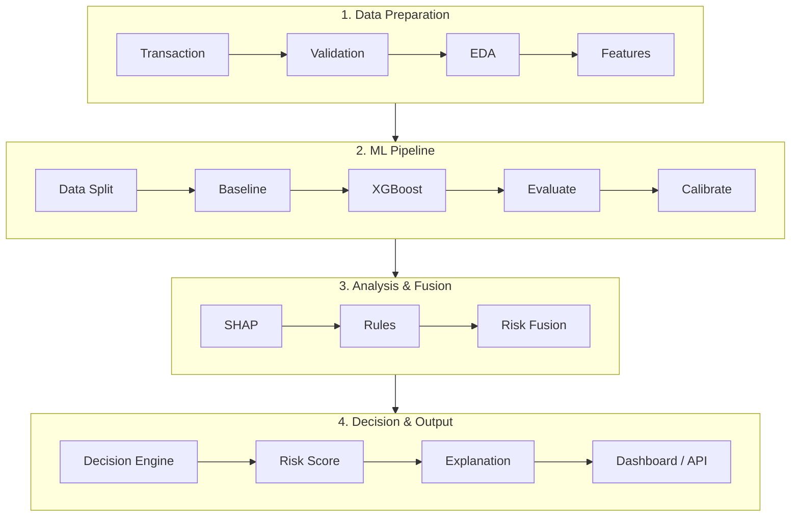

# RazorBrain

AI-powered transaction risk management for defensive fraud detection.


## Project Objective

RazorBrain analyzes transaction-level behavioral, contextual, and historical signals to estimate the likelihood of fraud and produce an actionable risk decision. The system supports real-time scoring, defensive rule evaluation, anomaly detection, explainable decisions, Allow / Review / Block routing, measurable fraud-detection performance, and audit-friendly decision evidence. 

The system is defensive only and strictly focuses on identifying and mitigating suspicious transaction risk.

## How the Risk System Works

RazorBrain treats fraud detection as a binary classification problem (Fraud = Yes / No) during model training, learning from transaction and behavioral features. The resulting fraud probability contributes to a broader risk assessment. 

Critically, the raw ML probability alone does not determine the final decision. RazorBrain explicitly separates:
1. Risk prediction
2. Risk evidence
3. Decision policy
4. Explanation

## Risk Detection Pipeline



## Modeling Pipeline

### Data Validation
Validate transaction fields, types, missing values, ranges, and consistency.

### Feature Engineering
Transform raw transaction data into risk-relevant features such as transaction amount, velocity, failed attempts, account age, previous transaction count, previous fraud history, device changes, location changes, amount deviation, merchant risk history, and behavioral aggregates. 

Historical features must represent information available at scoring time. No future information or current transaction labels leak into features.

### Data Splitting
Use a time-aware split where appropriate, ensuring:
Training → Validation → Held-out Test. The test set remains untouched during model development.

### Baseline
Establish a simple baseline before training more powerful models.

### XGBoost
Use XGBoost as the primary supervised fraud model. Final model performance is pending evaluation.

## Probability Calibration

Calibrated probabilities ensure the output represents a meaningful estimated probability of fraud rather than an arbitrary confidence number. This calibration is performed using training/validation data without leaking the held-out test set. 

## Rule Engine

Deterministic rules complement machine learning. Examples include excessive transaction velocity, repeated failed attempts, unusual device or location changes, extreme amount deviation, and suspicious behavioral combinations.

**Safety Rule**: A single weak signal (e.g., new device alone, new location alone) must not independently force a BLOCK decision. High-risk decisions require sufficient independent evidence.

## Risk Fusion

RazorBrain combines multiple evidence sources (ML probability, Rule evidence, Optional anomaly signals) into a unified risk assessment. Fusion strategies and weights are validated and tuned using appropriate validation data; they are not arbitrary hardcoded values.

## Decision Engine

The engine defines three operational outcomes based on policy parameters and business cost considerations:
- **Allow**: Low-risk transaction.
- **Review**: Uncertain or moderate-risk transaction requiring additional scrutiny.
- **Block**: High-risk transaction meeting the system's blocking policy.

## Explainability

**Risk Determination** and **Risk Explanation** are completely separate responsibilities. 

The risk engine determines the risk score, evidence, and decision. The explanation layer (utilizing SHAP for feature-level contribution) converts structured evidence into human-readable reasoning. The explanation model is strictly **READ-ONLY**:
- It cannot change the risk score or decision.
- It cannot override the risk engine.
- It cannot invent transaction facts.
- It must explicitly state when information is unavailable.

## Evaluation

Evaluation metrics include Precision, Recall, F1, PR-AUC, Confusion Matrix, and False-positive/False-negative costs. Accuracy alone is insufficient for fraud detection due to extreme class imbalance. 

Evaluation results will be reported once the model pipeline is complete and evaluated on the untouched, held-out test set.

## Cost-Aware Decisioning

Risk thresholds account for the asymmetric costs of errors:
- **False Positive**: Legitimate transaction incorrectly blocked/reviewed (Customer Friction Cost).
- **False Negative**: Fraudulent transaction incorrectly allowed (Missed Fraud Cost).

Total Cost = (False Negatives × Missed Fraud Cost) + (False Positives × Customer Friction Cost)

## Edge Cases

RazorBrain is designed to safely handle missing transaction fields, cold-start customers, new devices/locations, legitimate high-value purchases, duplicate/retry transactions, unreliable or shared IP addresses, class imbalance, delayed fraud labels, model drift, merchant-specific behavior, and sudden fraud spikes. Missing or unreliable information reduces confidence or routes the transaction toward review rather than crashing the system.

## Project Structure

```text
RazorBrain/
├── backend/
├── frontend/
├── data/
├── model/
├── evaluation/
├── tests/
├── .env.example
├── .gitignore
├── LICENSE
└── README.md
```

| Directory | Responsibility |
|-----------|----------------|
| backend | API and application services |
| frontend | Web interface |
| data | Dataset and data resources |
| model | ML components |
| evaluation | Model evaluation |
| tests | Automated tests |

## Technology Stack

| Layer | Technology |
|------|------------|
| Backend | Python, FastAPI |
| Machine Learning | XGBoost, scikit-learn, SHAP |
| Data | Pandas, NumPy |
| Frontend | React, TypeScript |
| Storage | PostgreSQL |
| Infrastructure | Docker |

## Development Principles

### Code Quality
- Standard professional naming
- Clear module responsibilities
- Type-safe interfaces where appropriate
- Small, maintainable modules
- Explicit validation and proper error handling
- Useful tests and minimal unnecessary dependencies

### Development Workflow
Before creating new code: **Inspect → Reuse → Extend → Refactor if justified → Test**. 
Working components should not be rewritten without a concrete reason. Duplicate utilities or services are strictly avoided.

## Safety

- Defensive use only.
- Synthetic data for development/demo purposes.
- No offensive fraud-enabling functionality.
- Secrets must never be committed; API keys remain server-side.
- Missing data must be handled safely.
- Explanation AI cannot make or modify risk decisions.

## Getting Started

Development setup is currently being established. (Repository is in the foundation stage).

## Project Status

RazorBrain is under active development. The initial repository structure and architecture documentation are established; the implementation of the risk pipeline is pending.
