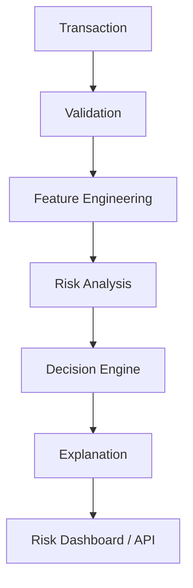

# RazorBrain

AI-powered transaction risk management for defensive fraud detection.


## Overview

RazorBrain is a transaction fraud risk management system designed to identify suspicious patterns and protect against fraudulent activity. It analyzes transaction signals, combines machine-learning with defensive rules, and provides interpretable risk scores. The system supports Allow, Review, or Block decisions with transparent explanations of its risk assessment, using held-out evaluation data to measure and ensure robust performance.

## How It Works



## Core Capabilities

| Capability | Purpose |
|------------|---------|
| Risk Scoring | Estimate transaction fraud risk |
| Rule Analysis | Detect explicit defensive risk signals |
| ML Detection | Learn fraud patterns from transaction data |
| Explainability | Show the factors contributing to risk |
| Decision Engine | Route transactions to Allow, Review, or Block |
| Evaluation | Measure performance on held-out data |
| Auditability | Preserve important risk decisions and evidence |

## Architecture

```text
Client / Dashboard
        │
        ▼
Application API
        │
        ▼
Risk Engine
 ┌──────┼────────┐
 ▼      ▼        ▼
ML     Rules   Anomaly
 │      │        │
 └──────┼────────┘
        ▼
Decision Engine
        │
        ▼
Explanation Layer
        │
        ▼
Audit / Evaluation
```

## Project Structure

```text
RazorBrain/
├── backend/       API and application services
├── frontend/      Web interface
├── data/          Dataset and data-generation resources
├── model/         Machine-learning components
├── evaluation/    Evaluation and metrics
├── tests/         Automated tests
├── .env.example
├── .gitignore
├── LICENSE
└── README.md
```

## Technology

**Backend**  
FastAPI · Python

**ML**  
XGBoost · scikit-learn · SHAP

**Frontend**  
React · TypeScript

**Data**  
Pandas · NumPy

**Infrastructure**  
Docker · PostgreSQL

## Development Principles

### Engineering Principles
- Reuse existing code before creating new code.
- Prefer incremental improvements over rewrites.
- Keep responsibilities separated and modules focused.
- Avoid duplicate logic and unnecessary dependencies.
- Use standard professional naming.
- Keep security-sensitive configuration outside source control.
- Validate inputs and handle missing data safely.
- Test important behavior before expanding functionality.
- Keep model decisions separate from explanation generation.

### Risk Principles
- Defensive fraud detection only.
- Synthetic data for development/demo purposes.
- Never use the LLM to determine fraud risk.
- The explanation layer may explain evidence but cannot change the decision.
- Never invent unavailable transaction facts.
- Never allow one weak signal to independently force a block decision.
- Keep the final test set held out for honest evaluation.

## Evaluation

RazorBrain evaluates the fraud detector strictly using held-out data kept separate from model development. Performance is measured using robust metrics such as Precision, Recall, F1, PR-AUC, Confusion Matrix, and False-positive cost. (Note: Evaluation is pending as the models are currently in active development).

## Getting Started

Development setup is being established.

## Project Status

RazorBrain is under active development. The foundational repository structure is complete.
